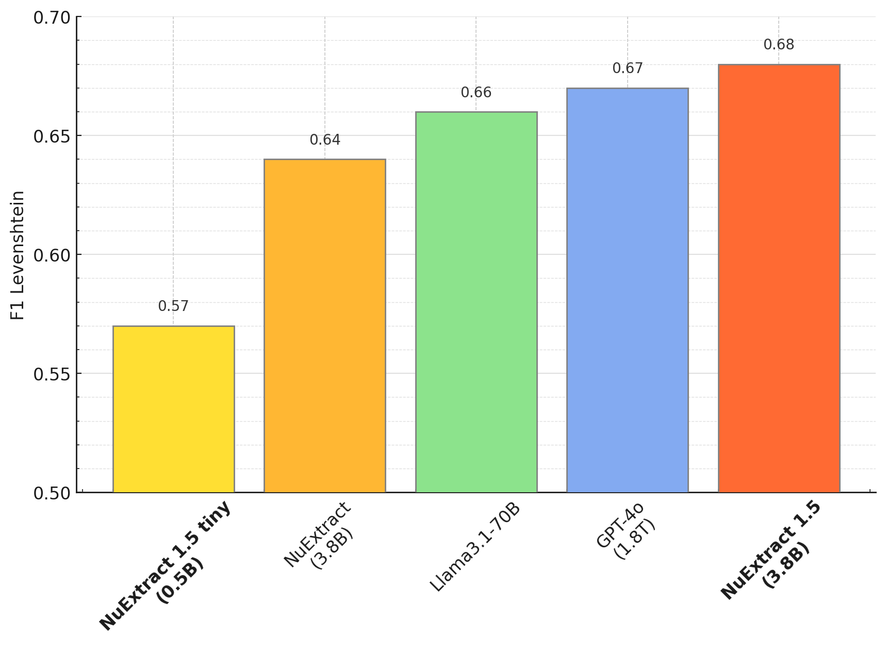
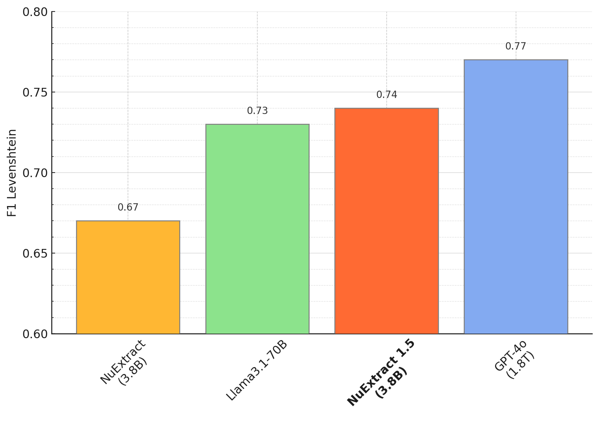
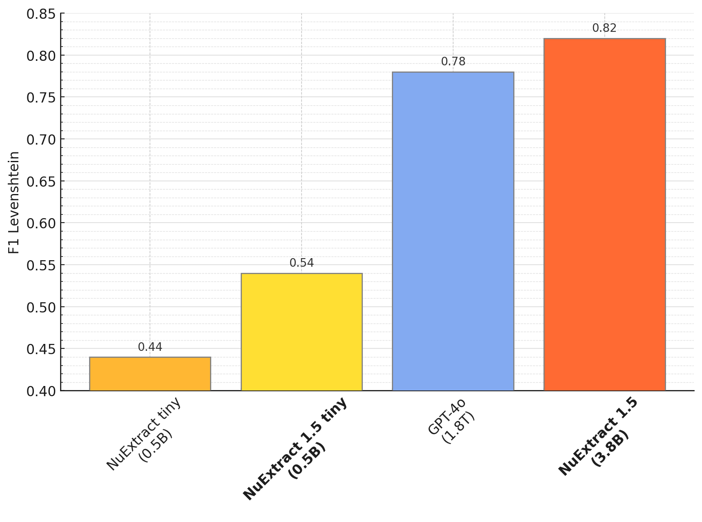
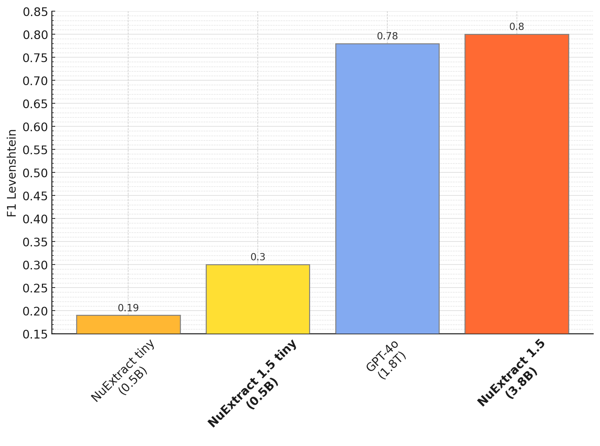
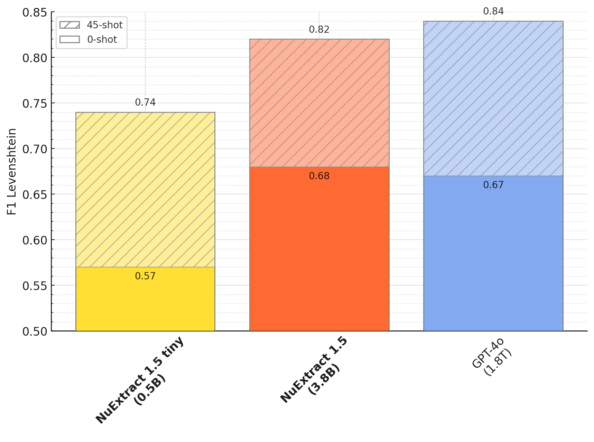

# NuExtract-v1.5 by NuMind 🔥

NuExtract-v1.5 is a fine-tuning of [Phi-3.5-mini-instruct](https://huggingface.co/microsoft/Phi-3.5-mini-instruct), trained on a private high-quality dataset for structured information extraction. It supports long documents and several languages (English, French, Spanish, German, Portuguese, and Italian).
To use the model, provide an input text and a JSON template describing the information you need to extract.

Note: This model is trained to prioritize pure extraction, so in most cases all text generated by the model is present as is in the original text.

Check out the [blog post](https://numind.ai/blog/nuextract-1-5---multilingual-infinite-context-still-small-and-better-than-gpt-4o).

Try it here: [Playground](https://huggingface.co/spaces/numind/NuExtract-v1.5)

We also provide a tiny (0.5B) version which is based on Qwen2.5-0.5B: [NuExtract-tiny-v1.5](https://huggingface.co/numind/NuExtract-tiny-v1.5)

## Benchmark

Zero-shot performance (English):

<p align="left">

</p>

Zero-shot performance (Multilingual):

<p align="left">

</p>

Long documents (8-10k tokens):

<p align="left">

</p>

Very long documents (10-20k tokens):

<p align="left">

</p>

Few-shot fine-tuning:

<p align="left">

</p>

## Usage

To use the model:

```python
import json
from transformers import AutoModelForCausalLM, AutoTokenizer

def predict_NuExtract(model, tokenizer, texts, template, batch_size=1, max_length=10_000, max_new_tokens=4_000):
    template = json.dumps(json.loads(template), indent=4)
    prompts = [f"""<|input|>\n### Template:\n{template}\n### Text:\n{text}\n\n<|output|>""" for text in texts]
    
    outputs = []
    with torch.no_grad():
        for i in range(0, len(prompts), batch_size):
            batch_prompts = prompts[i:i+batch_size]
            batch_encodings = tokenizer(batch_prompts, return_tensors="pt", truncation=True, padding=True, max_length=max_length).to(model.device)

            pred_ids = model.generate(**batch_encodings, max_new_tokens=max_new_tokens)
            outputs += tokenizer.batch_decode(pred_ids, skip_special_tokens=True)

    return [output.split("<|output|>")[1] for output in outputs]

model_name = "numind/NuExtract-v1.5"
device = "cuda"
model = AutoModelForCausalLM.from_pretrained(model_name, torch_dtype=torch.bfloat16, trust_remote_code=True).to(device).eval()
tokenizer = AutoTokenizer.from_pretrained(model_name, trust_remote_code=True)

text = """We introduce Mistral 7B, a 7–billion-parameter language model engineered for
superior performance and efficiency. Mistral 7B outperforms the best open 13B
model (Llama 2) across all evaluated benchmarks, and the best released 34B
model (Llama 1) in reasoning, mathematics, and code generation. Our model
leverages grouped-query attention (GQA) for faster inference, coupled with sliding
window attention (SWA) to effectively handle sequences of arbitrary length with a
reduced inference cost. We also provide a model fine-tuned to follow instructions,
Mistral 7B – Instruct, that surpasses Llama 2 13B – chat model both on human and
automated benchmarks. Our models are released under the Apache 2.0 license.
Code: <https://github.com/mistralai/mistral-src>
Webpage: <https://mistral.ai/news/announcing-mistral-7b/>"""

template = """{
    "Model": {
        "Name": "",
        "Number of parameters": "",
        "Number of max token": "",
        "Architecture": []
    },
    "Usage": {
        "Use case": [],
        "Licence": ""
    }
}"""

prediction = predict_NuExtract(model, tokenizer, [text], template)[0]
print(prediction)

```

Sliding window prompting:

```python
import json

MAX_INPUT_SIZE = 20_000
MAX_NEW_TOKENS = 6000

def clean_json_text(text):
    text = text.strip()
    text = text.replace("\#", "#").replace("\&", "&")
    return text

def predict_chunk(text, template, current, model, tokenizer):
    current = clean_json_text(current)

    input_llm =  f"<|input|>\n### Template:\n{template}\n### Current:\n{current}\n### Text:\n{text}\n\n<|output|>" + "{"
    input_ids = tokenizer(input_llm, return_tensors="pt", truncation=True, max_length=MAX_INPUT_SIZE).to("cuda")
    output = tokenizer.decode(model.generate(**input_ids, max_new_tokens=MAX_NEW_TOKENS)[0], skip_special_tokens=True)

    return clean_json_text(output.split("<|output|>")[1])

def split_document(document, window_size, overlap):
    tokens = tokenizer.tokenize(document)
    print(f"\tLength of document: {len(tokens)} tokens")

    chunks = []
    if len(tokens) > window_size:
        for i in range(0, len(tokens), window_size-overlap):
            print(f"\t{i} to {i + len(tokens[i:i + window_size])}")
            chunk = tokenizer.convert_tokens_to_string(tokens[i:i + window_size])
            chunks.append(chunk)

            if i + len(tokens[i:i + window_size]) >= len(tokens):
                break
    else:
        chunks.append(document)
    print(f"\tSplit into {len(chunks)} chunks")

    return chunks

def handle_broken_output(pred, prev):
    try:
        if all([(v in ["", []]) for v in json.loads(pred).values()]):
            # if empty json, return previous
            pred = prev
    except:
        # if broken json, return previous
        pred = prev

    return pred

def sliding_window_prediction(text, template, model, tokenizer, window_size=4000, overlap=128):
    # split text into chunks of n tokens
    tokens = tokenizer.tokenize(text)
    chunks = split_document(text, window_size, overlap)

    # iterate over text chunks
    prev = template
    for i, chunk in enumerate(chunks):
        print(f"Processing chunk {i}...")
        pred = predict_chunk(chunk, template, prev, model, tokenizer)

        # handle broken output
        pred = handle_broken_output(pred, prev)
            
        # iterate
        prev = pred

    return pred
```